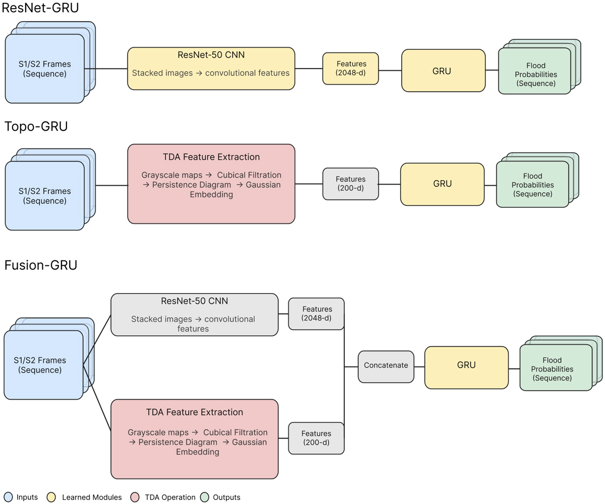
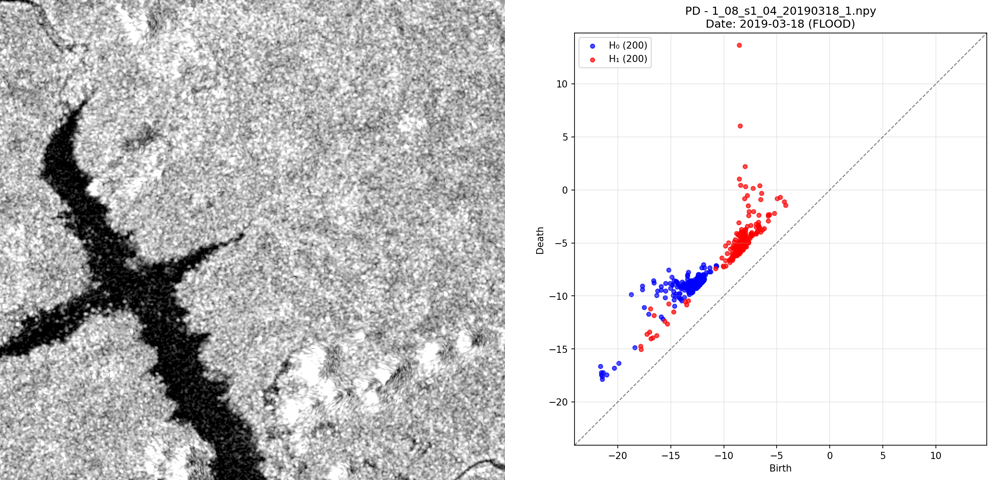
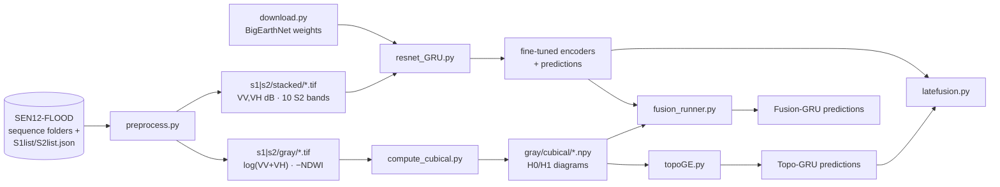

# Topology-Informed Flood Detection in SAR and Optical Imagery

Code for detecting floods in time series of Sentinel-1 radar and Sentinel-2 optical satellite images. It adds **persistent homology** (a way to measure the shape of an image: its connected regions and holes) to a ResNet-50 + GRU sequence model, and compares CNN-only, topology-only and fused models on the SEN12-FLOOD benchmark.

Paper: **Topology-Informed Neural Networks for Flood Detection in Optical and Synthetic Aperture Radar Imagery.** Sophia Li, Max Zhao, Raghu G. Raj, Tianyu Chen. [arXiv:2606.26204](https://arxiv.org/abs/2606.26204) (2026). Research done at the U.S. Naval Research Laboratory through the Science and Engineering Apprenticeship Program.

<p align="center">
  
</p>

## Result

Reported in the paper (Table 1 of arXiv:2606.26204), frame-level, on the held-out sequences (68 of 335; 62 for the radar-only models), unidirectional GRUs:

| Model | Input | F<sub>β</sub> (β=√2) | F1 | Accuracy | Previously reported accuracy¹ |
|---|---|---|---|---|---|
| ResNet50-GRU | S1 (radar) | 0.944 | 0.941 | 0.958 | 0.875 |
| Topo-GRU | S1 (radar) | 0.903 | 0.886 | 0.914 | – |
| ResNet50-GRU | S2 (optical) | 0.976 | 0.971 | 0.988 | 0.930 |
| Topo-GRU | S2 (optical) | 0.892 | 0.897 | 0.958 | – |
| ResNet50-GRU | S1 + S2 | 0.947 | 0.954 | 0.974 | 0.957 |
| Topo-GRU | S1 + S2 | 0.916 | 0.904 | 0.941 | – |
| **Fusion-GRU** | **S1 + S2** | **0.980** | **0.982** | **0.989** | – |

¹ Rambour et al., the ResNet-50 + GRU baseline that introduced SEN12-FLOOD.

What this shows:

- **Topology alone carries flood signal.** Topo-GRU uses a 200-number feature per image, about a tenth of the ResNet's 2048, and still reaches 0.914–0.958 accuracy.
- **Topology complements the CNN.** Concatenating the two features gives the best dual-sensor model: 0.989 accuracy against 0.974 for ResNet50-GRU on the same input, with false positives down from 6 to 3 and false negatives from 19 to 7 (Table 2 of the paper). Fusion-GRU also uses different CNN features (frozen encoders fine-tuned on each sensor separately), so this comparison does not isolate the topology features alone.

These numbers come from the paper. This repository does not include training logs or checkpoints, so re-running the pipeline is the way to check them (see [Reproduce](#reproduce) and [Limitations](#limitations)).

## The problem

Floods need to be mapped quickly, but optical satellites (Sentinel-2) cannot see through the clouds that come with storms. Radar (Sentinel-1 SAR) sees through clouds but is noisy and harder to read. SEN12-FLOOD gives both: 335 locations in Africa, Iran and Australia, each a time series of S1 and S2 images with a flooded / not-flooded label per image. Earlier work fed per-image CNN features into a GRU so the model could compare each image with the ones before it.

## What topology adds

Flood water shows up as large, connected dark regions in radar backscatter and as connected high-water-index regions in optical images. Persistent homology summarizes that kind of structure (how many regions there are, how large and how separated) as a short list of numbers, independent of where in the image they sit.

<p align="center">
  
</p>

For each image the pipeline:

1. **Builds a single-channel map.** S1: `10·log10(VV + VH)`. S2: negative NDWI, `−(B03 − B08)/(B03 + B08)`, so water is low in both.
2. **Runs a sublevel-set filtration on the cubical complex of pixels.** Sweeping a threshold from low to high, regions appear, merge and enclose holes. Each connected component (H0) and each loop (H1) is recorded as a (birth, death) pair: the threshold where it appears and where it disappears. Computed with [CubicalRipser](https://github.com/shizuo-kaji/CubicalRipser_3dim) (`cripser`) on a 120×120 resize.
3. **Turns the diagram into a fixed-length vector.** Keeps the 200 longest-lived pairs per dimension, then evaluates a lifetime-weighted Gaussian at a 10×10 grid of centers placed at quantiles of the *training* diagrams' births and deaths. Two dimensions × 100 centers = a 200-d feature per image (`topoGE.py`).

## Models

All three models predict a flood probability for **every frame** of a sequence (a GRU with hidden size 256, then a linear head).

| Model | Per-frame input | Script |
|---|---|---|
| ResNet50-GRU | 2048-d ResNet-50 features. `conv1` is replaced to take 2 SAR channels (VV, VH in dB) or 10 optical bands, initialized from [BigEarthNet v2.0](https://huggingface.co/BIFOLD-BigEarthNetv2-0) weights and fine-tuned | `resnet_GRU.py` |
| Topo-GRU | 200-d topological embedding only | `topoGE.py` |
| Fusion-GRU | Frozen fine-tuned ResNet features ‖ topological embedding = 2248-d | `fusion_runner.py` |

**Dual-sensor versions** merge each location's S1 and S2 images into one sequence in date order and add a learned modality embedding, so the GRU knows which sensor each frame came from.

**Training.** Weighted binary cross-entropy (positive weight = negative/positive frame ratio), Adam, batch size 8, checkpoint chosen by best F<sub>β</sub> with β = √2 (recall weighted above precision, since a missed flood costs more than a false alarm). Sequences with 4-digit ids are the training split and the rest are held out. After training, a threshold sweep reports the best recall at ≥ 90% precision. `latefusion.py` is a separate baseline that averages ResNet and Topo *probabilities* with a weight tuned on the held-out split. It is not the paper's Fusion-GRU.

**Labels.** Once a location is labelled flooded on some date, the preprocessing marks every later frame of that location as flooded (`preprocess.py`, "flood start" hypothesis).

## Reproduce

Tested with Python 3.9.12 on an NVIDIA Titan XP (CUDA 11.7). `resnet_GRU.py` requires a CUDA GPU; the pinned `torch==1.13.1` does not support Python 3.11 or newer.

```bash
pip install -r requirements.txt
```

**Data.** Download SEN12-FLOOD from [Source Cooperative](https://source.coop/esa/sen12flood) or [IEEE Dataport](https://ieee-dataport.org/open-access/sen12-flood-sar-and-multispectral-dataset-flood-detection). The scripts expect the numbered sequence folders directly under the working folder, and `S1list.json` / `S2list.json` (the dataset's label files) in the working folder.



```bash
python preprocess.py --s1-dir s1 --s2-dir s2 --sen12-root .   # clean, convert, relabel, write GeoTIFFs
python compute_cubical.py s1/gray                             # persistence diagrams (H0, H1)
python compute_cubical.py s2/gray
python download.py                                            # BigEarthNet v2.0 ResNet-50 weights

python resnet_GRU.py            # linear probes, then ResNet50-GRU on S1, S2, and S1+S2
python topoGE.py                # Topo-GRU on S1, S2, and S1+S2
python fusion_runner.py         # Fusion-GRU (needs the fine-tuned encoders from resnet_GRU.py)
python latefusion.py            # optional score-averaging baseline (expects both uni- and bidirectional runs)
```

Add `--bidirectional` to the three training scripts for bidirectional GRUs. Each script writes per-frame predictions (`*_detailed_predictions.txt`) and a log file to the working folder. `topoGE.py` and `fusion_runner.py` set deterministic CUDA algorithms themselves; `resnet_GRU.py` is seeded but not fully deterministic.

**Other tools.** `visualize_pd.py s1/gray/cubical --sequence 1` plots the persistence diagrams of one sequence along with how they change over time (persistence entropy and Wasserstein distance between dates). `sequence_map.py` draws the dataset's locations on a map from the GeoJSON label files in `./labels/`.

## Limitations

- **The held-out split doubles as the validation set.** The code uses the same held-out sequences to pick checkpoints, choose the reported threshold and tune the late-fusion weight. The numbers above are therefore optimistic compared with a separate test set.
- **The code does not match the paper in every setting.** The paper describes up to 200 epochs, one learning rate of 0.001, early stopping for all models, a cutoff of 0.001 on the standard deviation of valid pixels and a 16-d modality embedding. The code uses 100 / 400 / 100 epochs (ResNet / Topo / Fusion), separate learning rates for the ResNet backbone (1e-4) and the GRU (1e-3), no early stopping for Fusion-GRU, a cutoff of 0.01, and a 16-d embedding for ResNet-GRU but 8-d for Topo- and Fusion-GRU.
- **The dual ResNet50-GRU starts from BigEarthNet weights, not the fine-tuned single-sensor encoders.** It looks for `resnet_gru_s1_finetune.pt`, but single-sensor training saves `resnet_gru_s1_finetune_uni.pt`.
- One dataset, one random seed per configuration, no error bars.
- The "flood start" relabelling assumes water does not recede within a sequence.
- No training logs, checkpoints or result files are committed.

## Citation

```bibtex
@misc{li2026topology,
  title         = {Topology-Informed Neural Networks for Flood Detection in Optical and Synthetic Aperture Radar Imagery},
  author        = {Li, Sophia and Zhao, Max and Raj, Raghu G. and Chen, Tianyu},
  year          = {2026},
  eprint        = {2606.26204},
  archivePrefix = {arXiv}
}
```

This work was funded by the Office of Naval Research under the NRL Base Program and the NRL Science and Engineering Apprenticeship Program (SEAP). SEN12-FLOOD is by Rambour et al.; the pretrained weights are from BIFOLD's BigEarthNet v2.0.
